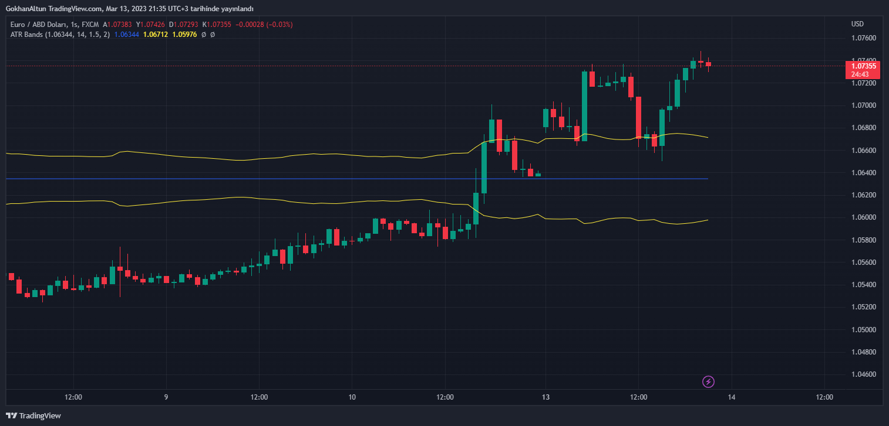

# Price_Based-ATR_Bands-indicator
 Fixed Price Based ATR Bands indicator For TradingView(Pinescript)

 ### Warning Note:
 It is not for generating buy-sell signals.
 Making a trading decision with this indicator alone can have negative consequences!

 ### Screenshot

  </img>

 ### Code

```js
// This source code is subject to the terms of the Mozilla Public License 2.0 at https://mozilla.org/MPL/2.0/
// © GokhanAltun

//@version=5
indicator("ATR Bands", overlay = true)

group_setup = "Setup Settings"


price = input.price(0.0, title = "Price", confirm = true, group = group_setup)
atr_len = input.int(14, title = "ATR Length", group = group_setup)
atr_x = input.float(1, title = "ATR Multiplier", step = 0.1, group = group_setup)


atr_out = (ta.atr(atr_len) * atr_x)
rounded_price = math.round(price, int(math.log10(1/syminfo.mintick)))

atr_band_up = rounded_price + atr_out
atr_band_down = rounded_price - atr_out


plot(rounded_price, title = "Price Line", color = color.blue)
plot(atr_band_up, title = "ATR Band Up", color = color.yellow)
plot(atr_band_down, title = "ATR Band Down", color = color.yellow)
```
